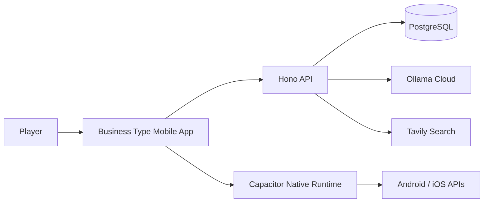
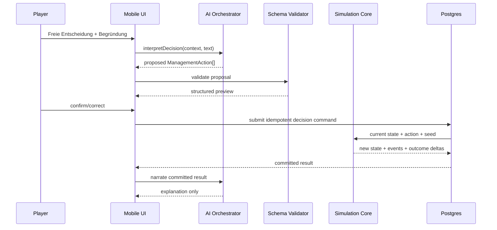

# Architecture — Business Type

## 1. Architecture goals

Business Type braucht maximale Konsistenz bei gleichzeitig freier Spracheingabe. Die Architektur trennt daher **Interpretation** von **Autorität**: LLMs dürfen Bedeutung erschließen, aber nur der pure Simulation Core darf den Unternehmenszustand verändern.

Primäre Ziele:
- mobile Android/iOS App aus einer Web-Codebasis;
- reproduzierbare Simulation;
- Provider-austauschbare AI/Search-Schicht;
- geringe Infrastruktur- und Betriebs-Komplexität;
- testbare Domain ohne Cloud/React;
- sichere Multi-User-Persistenz.

## 2. Architecture style

**Modularer Monolith + Vertical Feature Slices + zentraler Domain Core.**

Vertical Slices organisieren Nutzerflows. Domain-Module kapseln fachliche Regeln, die zwischen mehreren Features geteilt werden.

```text
src/
├── app/              # App shell + run orchestration
├── features/         # scenario/company/decision/advisor/timeline/auth
├── domain/           # public re-exports of the pure shared core
├── ai/               # schemas + local grounded fallback
├── infrastructure/   # API client, remote game, AI, debrief, local store
└── shared/ui/        # small presentation primitives

shared/domain/
├── types.ts
├── scenarios.ts
├── engine.ts
└── index.ts

server/               # Hono API for Hostinger
deploy/               # docker compose web + api + postgres
```

## 3. System context



## 4. Runtime containers

| Unit | Responsibility | Technology | Owns |
|---|---|---|---|
| Mobile/Web client | UI, local transient state, cached read model | React/Vite/Capacitor | no authoritative game state |
| Simulation Core | calculate validated state transitions | pure TypeScript | rules and invariants |
| AI Orchestrator | tool routing, decision parsing, narrative | server TypeScript | prompt/tool contracts |
| API + Postgres | auth, ownership checks, persisted runs | Hono + Postgres | authoritative persistence |
| Research Debrief | external real-world comparison sources | isolated API route + Tavily | no game state |
| LLM adapter | Ollama Cloud (OpenAI-compatible) + fallback model | provider adapter | no game state |

## 5. Dependency direction

```text
features --> application services --> domain
features --> shared/ui
application services --> ai contracts
infrastructure --> domain interfaces / ai interfaces

domain -X-> react
 domain -X-> capacitor
 domain -X-> server_db
 domain -X-> llm/search SDKs
```

## 6. Authoritative decision flow



Die Narrative ist nachgelagert. Ein LLM-Fehler darf den bereits berechneten State nicht ändern.

## 7. Information flow

Interne Fragen verwenden ausschließlich freigegebene Scenario-/Run-Daten. Hidden/researchable Informationen werden serverseitig gefiltert.

Externe Recherche ist nur im Debrief-Kontext aktiv und hat keinen Zugriff auf State-Mutationswerkzeuge.

## 8. Data architecture

Für den MVP wird ein **hybrides Postgres-Modell** empfohlen:

- relationale Tabellen für Nutzer, Szenarien, Versionen, Runs, Entscheidungen, Analysen, Reviews und Usage;
- `WorldState` als versioniertes, schema-validiertes JSONB-Snapshot pro Run;
- append-only `run_events` für Replay/Audit;
- periodische Snapshots, damit Replay nicht immer von Event 0 starten muss.

Das reduziert frühe Migrationskosten, ohne den State unstrukturiert zu machen. Domain-Schemas bleiben in TypeScript versioniert und werden beim Lesen/Schreiben validiert.

Kernobjekte:

```text
profiles
scenarios
scenario_versions
runs
run_snapshots
run_events
decisions
analysis_requests
decision_reviews
advisor_threads
advisor_messages
llm_usage
```

## 9. Event sourcing scope

Business Type nutzt **event-sourced history**, aber keinen dogmatischen Event-Sourcing-Stack.

- Entscheidungen und Events sind append-only.
- Current State wird als Snapshot gespeichert.
- Replay dient Debugging, Audit, Score-Erklärung und reproduzierbaren Runs.
- Kein CQRS-/Message-Bus-Framework im MVP.

## 10. Simulation determinism

Deterministische Inputs:

```text
scenarioVersion
previousWorldState
validatedManagementActions
simulationClock
seed
```

Output:

```text
newWorldState
immediateEffects
delayedEvents
scoreInputs
auditMetadata
```

Alle Random-Ziehungen verwenden einen injizierten seeded RNG. Keine direkte Nutzung von `Math.random()` im Domain Core.

## 11. AI architecture

Ein Modell spielt nicht „wirklich“ CFO, CTO und HR als getrennte Agents. Rollen sind Konfigurationen über denselben Orchestrator:

```text
AdvisorRole
- system instruction
- allowed company tools
- data visibility
- tone constraints
```

Default Provider: Ollama Cloud (`https://ollama.com/v1`, env `OLLAMA_API_KEY`).
Fallback: konfigurierbares Zweitmodell (`LLM_FALLBACK_MODEL`) bei Provider-/Output-Fehlern.

Fallback-Gründe können sein:
- wiederholt invalides Action-Schema;
- komplexe mehrteilige Entscheidung mit niedriger Parser-Confidence;
- Scenario-Authoring/QA außerhalb des Runtime-Kernloops.

## 12. Tool boundary

Beispielhafte Tools:

```text
company.getOverview
finance.getSummary
customer.getPortfolio
workforce.getSummary
operations.getCapacity
analysis.request
analysis.getResult
run.getTimeline
research.searchRealWorldCases
```

`research.searchRealWorldCases` läuft in einem getrennten Toolset ohne Mutationstools.

## 13. Security / trust boundaries

- Client ist untrusted.
- LLM ist untrusted.
- Search-Inhalte sind untrusted.
- API erzwingt Ownership serverseitig (owner_id + JWT).
- Service Role/Provider Keys existieren nur serverseitig.
- Mutationen werden serverseitig validiert und idempotent gemacht.
- User-ID kommt aus der verifizierten Session, nie aus frei gesetzten Client-Feldern.
- Prompt Injection aus externen Quellen kann keine Game-State-Mutation auslösen.

## 14. Mobile / Capacitor

Capacitor ist von Beginn an Runtime-Ziel, kein späterer Wrapper.

- Web-Build bleibt Quelle für Android/iOS.
- Safe Areas und Keyboard-Verhalten werden im Styleguide berücksichtigt.
- Native Plugins werden nur eingeführt, wenn ein konkreter User-Need existiert.
- V1 benötigt voraussichtlich keine komplexen nativen Plugins außer App/Keyboard/Haptics/StatusBar-ähnlichen Basisfunktionen.
- Kein kritischer Simulationszustand ausschließlich auf dem Gerät.
- Resume/foreground reconciled gegen Serverzustand.

## 15. Offline strategy

MVP ist **online-authoritative**.

Offline erlaubt:
- zuletzt gecachten Company State ansehen;
- Decision Draft lokal halten.

Offline nicht erlaubt:
- neue Analyse verbindlich starten;
- eine Entscheidung autoritativ simulieren;
- externe Recherche durchführen.

Beim Reconnect wird zuerst der Run-State reconciled.

## 16. Failure handling

| Failure | Verhalten |
|---|---|
| LLM timeout | ein Retry; danach verständlicher Fehler, keine Mutation |
| Invalid LLM schema | einmal reparieren/retry; optional Fallback-Modell; keine Mutation |
| Search outage | Debrief ohne externe Beispiele möglich |
| API/DB mutation timeout | idempotency key abfragen/reconcile, nie blind erneut anwenden |
| Offline | read-only + Draft-Modus |
| Event processing failure | Transaktion rollback; Event nicht halb anwenden |

## 17. Observability

Erfassen:
- LLM latency, model, token usage, tool-call validation failure;
- decision command latency/success/idempotency replay;
- simulation rule errors;
- RLS/auth failures ohne sensitive payloads;
- client crash/error category;
- scenario/version distribution.

Nicht standardmäßig erfassen:
- vollständigen Freitext von Entscheidungen;
- vollständige Advisor-Chats;
- Provider-Secrets/Prompts.

## 18. Testing architecture

1. Domain Unit Tests: Rules, seeded outcomes, invariants.
2. Property Tests optional ab komplexeren Regeln: Probability bounds, money invariants.
3. Contract Tests: LLM Action Schema, API payloads.
4. Integration Tests: decision commit + event/snapshot transaction.
5. E2E: ein kompletter Vertical Slice auf Web; Android/iOS Smoke Tests vor Store-Build.
6. Visual/Accessibility: `@verify-ui` gegen Styleguide.

## 19. Deployment

Zunächst modularer Monolith:

```text
Client build -> Web / Capacitor Android / Capacitor iOS

Hinweis: `android/` und `ios/` werden durch `npm run native:setup` nach installiertem Dependency-Tree erzeugt; der Erzeugungscontainer hatte keinen npm-Netzzugriff.
Server API -> Hono on Node (Docker)
Persistence -> Postgres
External -> LLM/Search providers
```

Keine Microservices bis ein messbarer Skalierungs-/Ownership-Grund vorliegt.

## 20. Initial vertical slice

Erster Slice: ein vollständiges SaaS-CEO-Szenario mit genau einem kritischen Decision Loop:

```text
Scenario wählen
-> Company ansehen
-> CFO/Team fragen
-> Analyse anfordern
-> freie Entscheidung + Begründung
-> Action Preview
-> Commit
-> Simulation
-> Decision Quality
-> Timeline/Outcome
```

Wenn dieser Slice nicht konsistent und spielerisch überzeugend funktioniert, werden weitere Branchen nicht gebaut.


## 15. Concurrency and write safety

Autoritative Cloud-Runs besitzen eine serverseitige `revision`. Jede Mutation lädt State + Revision und schreibt nur mit `WHERE revision = expectedRevision`. Parallele Writes können daher nicht still überschreiben; ein Verlierer erhält HTTP 409 und muss den aktuellen Run neu laden.

AI- und Research-Endpunkte besitzen getrennte per-user/hourly Quotas. Client-Identität wird ausschließlich aus verifiziertem JWT abgeleitet.

## 16. Current implementation caveat

Der lokale Demo-Modus nutzt denselben puren Scenario-/Simulation-Core im Client und ist damit für Offline-Spielbarkeit bewusst inspectable. Competitive/leaderboard-relevante Runs müssen Cloud-authoritative sein; dort erfolgen Mutationen ausschließlich serverseitig.
