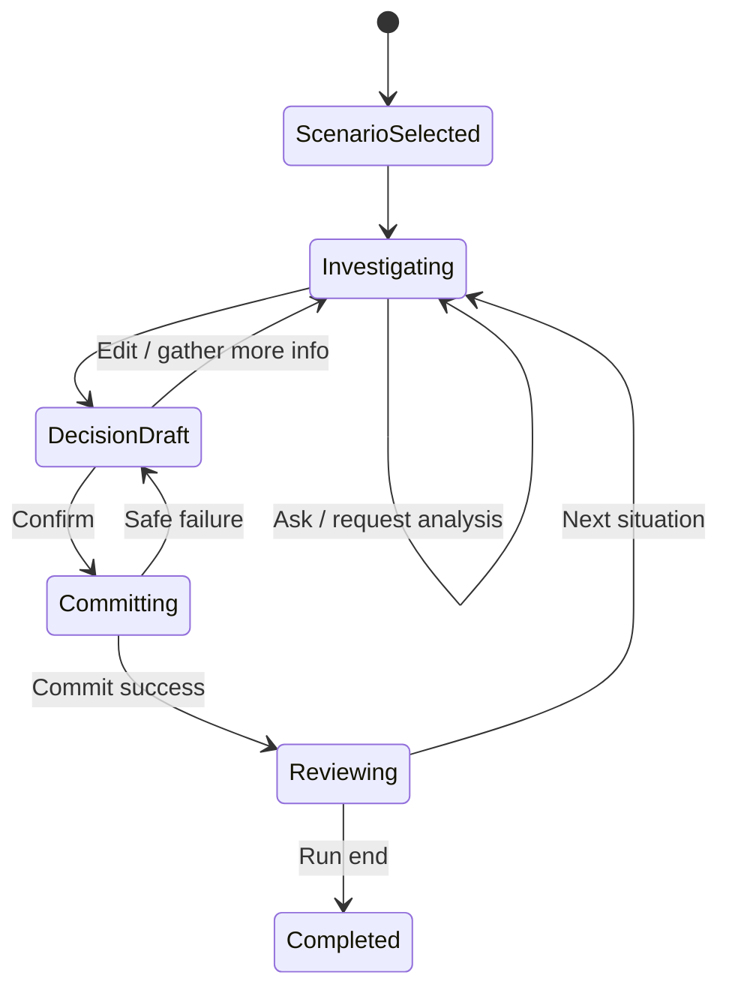

# Product Requirements Document: Business Type

<!-- prd-section:document-control -->
## 0. Document control

| Field | Value |
|---|---|
| Status | In review |
| Implementation readiness | READY WITH ASSUMPTIONS |
| Version | 0.2 |
| Last updated | 2026-09-12 |
| Product owner | User / repository owner |
| Technical owner | [UNKNOWN] |
| Target release | [UNKNOWN] |
| Evidence cutoff | 2026-09-12 |

### Change history

| Version | Date | Change | Source / decision |
|---|---|---|---|
| 0.1 | 2026-09-11 | Initial implementation-ready product contract | S-001–S-008 |
| 0.2 | 2026-09-12 | MVP implementation aligned: three scenarios, cloud authority, research debrief, concurrency control | S-009 |

<!-- prd-section:source-ledger -->
## 1. Evidence and source ledger

| Source ID | Source | Evidence summary | Reliability | Affected sections |
|---|---|---|---|---|
| S-001 | Conversation, Business Type concept | Mobile CEO simulation across industries/stages; free information gathering and free-form decisions | Direct | 2–10 |
| S-002 | Conversation, simulation architecture | Hybrid: deterministic rules + probabilistic consequences + LLM interpretation; seeded replay | Direct / accepted proposal | 3, 7, 11, 13 |
| S-003 | Conversation, scoring | Decision Quality must be separate from Outcome; six decision dimensions; geometric mean proposed and accepted in direction | Direct / accepted proposal | 7–9, 16–18 |
| S-004 | Conversation, UI concept | Executive Decision Room visual concept was generated and user said it looks good | Direct | 10 |
| S-005 | GitHub repository `iamthamanic/BusinessTypeSim` | Empty greenfield repository, default branch main, write permission available | Verified repository | 14, 19 |
| S-006 | Conversation, target stack | React/Vite/TypeScript, Capacitor from start, Supabase, GLM-5.3-Flash default and GLM-5.3 fallback | Direct / accepted proposal | 13–16 |
| S-007 | Current Supabase documentation inspected via Context7 | Supabase provides Postgres, Auth, RLS, APIs, Functions, Storage/Realtime capabilities | External primary docs | 12–14 |
| S-008 | Current Capacitor documentation inspected via Context7 | Capacitor supports web-first apps packaged for Android/iOS from a shared codebase | External primary docs | 10, 13, 14 |
| S-009 | Repository implementation on `chore/project-setup` | React/Capacitor MVP, three scenarios, pure seeded engine, Supabase Edge Functions, GLM adapter, Tavily debrief and QA artifacts implemented | Verified implementation | 5, 7–19, 22 |

### Conflicts

Keine bekannten Kernkonflikte. Repository ist derzeit öffentlich; die gewünschte langfristige Sichtbarkeit/Lizenz ist nicht bestätigt und wird als Q-002 geführt.

<!-- prd-section:summary -->
## 2. Executive summary

### Context

Business-Entscheidungsspiele existieren, bilden aber häufig entweder feste Optionen, eine einzelne Branche oder rein operative Tycoon-Mechaniken ab. Business Type soll eine mobile, branchenübergreifende CEO-Simulation sein, in der Informationsbeschaffung, freie Entscheidungen, Unsicherheit und langfristige Folgen zusammengehören. [CONFIRMED] S-001

### Problem

Bestehende Simulationen vermitteln leicht die falsche Gleichung „gutes Ergebnis = gute Entscheidung“. Außerdem bilden sie häufig nicht ab, dass CEOs je nach Branche, Größe, Kapitalintensität, Organisation und Unternehmensphase andere Probleme lösen müssen. [CONFIRMED] S-001, S-003

### Proposed solution

Eine persistente Unternehmenswelt mit einem autoritativen TypeScript-Simulationskern. Spieler können interne Informationen abfragen, Analysen mit Zeitkosten anfordern, virtuelle Führungskräfte befragen und freie Entscheidungen formulieren. Ein LLM interpretiert Sprache und erklärt Ergebnisse; es verändert den State nicht selbst. [CONFIRMED] S-001, S-002, S-006

### Value proposition

„Trainiere nicht die richtige Antwort, sondern die Qualität deiner Entscheidung unter Unsicherheit.“ [INFERRED] aus S-001–S-003

### Desired outcomes

| Goal ID | Outcome | Baseline | Target | Measurement window | Status / source |
|---|---|---|---|---|---|
| G-001 | Spieler kann einen kompletten CEO-Decision-Loop ohne A/B/C-Zwang spielen | 0 | 1 vollständiger Vertical Slice | MVP | [CONFIRMED] S-001 |
| G-002 | Decision Quality und Outcome sind sichtbar getrennt | 0 | 100 % der committed Entscheidungen im Slice | MVP | [CONFIRMED] S-003 |
| G-003 | Gleicher Seed/State/Action erzeugt reproduzierbaren Simulationsoutput | 0 | 100 % der determinism fixtures | jeder Build | [CONFIRMED] S-002 |
| G-004 | Ein Domain Core trägt deutlich unterschiedliche Unternehmenskontexte | 0 | 3 MVP-Szenariotypen ohne Branch-Fork der Engine | MVP | [PROPOSED] S-001 |
| G-005 | LLM ist austauschbar und nicht autoritativ | 0 | alle LLM Calls hinter Adapter; 0 direkte State Writes | jeder Build | [CONFIRMED] S-006 |

### Non-goals

MVP enthält keinen Multiplayer, keine globale persistente Weltwirtschaft, keine 3D-Welt, keine individuelle Simulation jedes Mitarbeiters, keine 50 Branchen, keine Multi-Agent-Infrastruktur pro Advisor und kein Monetarisierungssystem. [CONFIRMED] S-001/S-002 als akzeptierter Scope-Schnitt

<!-- prd-section:constitution -->
## 3. Product constitution and constraints

### Durable principles

1. Simulation Authority liegt nie beim LLM. [CONFIRMED] S-002
2. Decision Quality ist nicht Outcome Quality. [CONFIRMED] S-003
3. Keine versteckte korrekte Antwort für strategische Entscheidungen. [CONFIRMED] S-001/S-003
4. Spielerwissen und Unternehmenswahrheit sind getrennte Zustände. [PROPOSED] abgeleitet aus Informationsmechanik.
5. Zufall ist seeded/replaybar. [CONFIRMED] S-002
6. Mobile ist Primärsurface; Android/iOS werden von Anfang an berücksichtigt. [CONFIRMED] S-006/S-008
7. Neue Infrastruktur wird nur bei nachgewiesenem Bedarf eingeführt. [PROPOSED]

### Hard constraints

- TypeScript strict im App-/Domain-Code. [PROPOSED]
- Pure Domain ohne React/DB-Client/LLM/Capacitor Imports. [PROPOSED]
- Server-side Secret Boundary für LLM/Search. [PROPOSED]
- Postgres + self-hosted API als Backend-Ziel (Hostinger). [CONFIRMED] ADR-0002

### Dependencies

Self-hosted Postgres/API, Ollama Cloud und optional Tavily Search für den Real-World-Debrief. Search bleibt ein austauschbarer Serveradapter und blockiert den Core Loop bei Ausfall nicht. [CONFIRMED] ADR-0002/ADR-0004

### Glossary

| Term | Definition | Source |
|---|---|---|
| WorldState | autoritativer Zustand einer simulierten Firma zu einem Simulationszeitpunkt | S-002 |
| Decision Quality | Qualität des Entscheidungsprozesses zum Commit-Zeitpunkt | S-003 |
| Outcome | später tatsächlich eingetretene Unternehmenswirkung | S-003 |
| Known information | ohne Zusatzaufwand verfügbare Unternehmensinformation | S-001 |
| Researchable information | durch Analyse freischaltbare Information mit Zeit-/Ressourcenkosten | S-001 |
| Hidden information | aktuell nicht sichtbare Spielwahrheit | S-002 |
| ManagementAction | validierte strukturierte Repräsentation einer Spielerentscheidung | S-002 |
| Decision Ledger | chronologische/kausale UI-Spur von Situation bis Folge | S-004 |

<!-- prd-section:users -->
## 4. Users, actors, and stakeholders

| Actor / role | Job to be done | Need / pain | Access boundary | Success signal | Source |
|---|---|---|---|---|---|
| Player | CEO-Entscheidungen trainieren/spielen | realistische Trade-offs statt Quiz | eigener Run + freigegebene Scenario-Daten | vollständiger Decision Loop | S-001 |
| Advisor role | fachliche Perspektive liefern | relevante, begrenzte Sicht | nur role-allowed data/tools | Antwort ist datengetreu und nützlich | S-001/S-002 |
| Scenario author/admin | Szenarien versionieren | konsistente Regeln und Rubrics | privilegierte Authoring-Rolle | veröffentlichte immutable Version | [PROPOSED] |
| Support/ops | technische Fehler diagnostizieren | Replay ohne private Inhalte | Metadaten/Audit, nicht fremde Chats standardmäßig | Fehler reproduzierbar | [PROPOSED] |

### Accessibility and inclusion needs

Mobile Kernflows sollen WCAG 2.2 AA entsprechen bzw. äquivalente native Bedienbarkeit bieten; keine Information nur über Farbe, Reduced Motion respektieren und dynamische Schriftgrößen unterstützen. [PROPOSED]

### Stakeholder responsibilities

Product verantwortet Game Design/Scoring-Rubrics; Engineering Domain-Invarianten/Provider-Boundaries; Scenario Authoring Content und Kalibrierung. Konkrete Personen sind [UNKNOWN].

<!-- prd-section:scope -->
## 5. Scope and release boundary

### MVP / current release

- Mobile-ready React/Vite/Capacitor App Shell.
- Self-hosted Auth (JWT) und Persistenz-Grundlage.
- Drei vollständig spielbare Fälle: SaaS-Scale-up, etablierter Produzent und kleines Professional-Services-Unternehmen.
- Company Overview, Decision Room, Advisor, Analysis Request, Decision Composer, Simulation, Decision Review, Timeline.
- GLM-5.3-Flash Runtime Adapter und validierte Tool-/Action-Contracts.
- Seeded Simulation Core.
- Decision Quality getrennt von Outcome.
- Gemeinsamer Domain Core trägt alle drei Szenariotypen ohne Branchen-Fork der Engine.
- Read-only Real-World-Debrief nach committed Entscheidungen.

### Later releases

Counterfactual/Luck-View, Daily Challenge, weitere Branchen/Stages, erweiterte Analytics, längere Multi-Decision-Campaigns und optionales Scenario Authoring UI.

### Explicitly out of scope

Multiplayer, Macro-world simulation, User-to-user economy, 3D, Store-Monetarisierung, umfassende Offline-Simulation, individuelle Mitarbeiteragenten.

### Scope assumptions

A-001: Drei Szenariotypen sind genug, um Branch-Generalität zu validieren. [PROPOSED]
A-002: Online-authoritative Gameplay ist für MVP akzeptabel. [PROPOSED]
A-003: Ein GLM-Modell kann mit Tools/Schema-Validation ausreichend zuverlässig interpreten; wird durch eigenes Eval validiert. [PROPOSED]

<!-- prd-section:journeys -->
## 6. User journeys and process flows

### Journey J-001: CEO decision loop

| Step | Actor | Trigger / action | Touchpoint | System state and data | Failure / recovery | Analytics |
|---|---|---|---|---|---|---|
| 1 | Player | Szenario starten | Scenario Selection | neue Run-ID + immutable scenarioVersion | Startfehler -> Retry | `run_started` |
| 2 | Player | Lage ansehen | Company/Decision Room | visible knowledge read model | offline -> cached read-only | `decision_opened` |
| 3 | Player | Team fragen | Advisor | read-only tool calls | model/tool error -> retry | `advisor_turn_completed` |
| 4 | Player | Analyse anfordern | Analysis Sheet | request + sim duration | invalid/unavailable -> explain | `analysis_requested` |
| 5 | System | Zeit fortschreiten | Timeline | due events/analysis result | atomic rollback on failure | `simulation_advanced` |
| 6 | Player | Entscheidung formulieren | Composer | draft only | offline -> local draft | `decision_draft_validated` |
| 7 | Player | Interpretation bestätigen | Preview | validated actions | edit if ambiguous | `decision_confirmed` |
| 8 | System | commit/simulate | Server/Engine | new snapshot + events | idempotent reconcile | `decision_committed` |
| 9 | Player | Review ansehen | Decision Review | quality subscores | partial unavailable -> explain | `review_viewed` |
| 10 | Player | Folgen erleben | Timeline/Outcome | delayed effects | dependency outage -> cached state | `outcome_viewed` |

### Alternate, admin, support, and destructive flows

Run-Abbruch/Archivierung ist späterer Scope; keine Hard-Delete-UI im MVP. Scenario-Publishing ist admin-only und kann zunächst über Seed/DB-Workflow statt UI erfolgen. [PROPOSED]

### State model



<!-- prd-section:functional-requirements -->
## 7. Functional requirements

| ID | Requirement | Priority | Status | Rationale | Sources | Acceptance | Dependencies |
|---|---|---|---|---|---|---|---|
| FR-001 | Das System soll dem Spieler verfügbare Szenarien mit Branche, Stage und Komplexitätsmerkmalen anzeigen und einen versionierten Run starten können. | Must | [CONFIRMED] | Einstieg | S-001 | SCN-001 | DATA-001 |
| FR-002 | Das System soll nur die für den aktuellen Knowledge State freigegebenen Unternehmensdaten anzeigen. | Must | [PROPOSED] | Hidden-info integrity | S-001,S-002 | SCN-002 | BR-001 |
| FR-003 | Der Spieler soll virtuelle Advisor in freier Sprache befragen können; Antworten müssen ausschließlich erlaubte read-only Daten/Tools verwenden. | Must | [CONFIRMED] | Investigation | S-001,S-002 | SCN-003 | FR-002 |
| FR-004 | Der Spieler soll researchable Analysen anfordern können; deren konfigurierte Simulationszeit und Verfügbarkeit müssen vor Commit sichtbar sein. | Must | [CONFIRMED] | Informationskosten | S-001 | SCN-004 | BR-002 |
| FR-005 | Der Spieler soll eine Managemententscheidung und optional ihre Begründung als Freitext formulieren können. | Must | [CONFIRMED] | freie Entscheidungen | S-001 | SCN-005 | none |
| FR-006 | Das System soll Freitext in schema-validierte ManagementActions interpretieren und vor autoritativem Commit eine korrigierbare Vorschau anzeigen. | Must | [CONFIRMED] | AI safety/intent fidelity | S-002 | SCN-005,SCN-006 | BR-003 |
| FR-007 | Nur bestätigte und serverseitig validierte ManagementActions dürfen einen WorldState über die Simulation Engine verändern. | Must | [CONFIRMED] | authority | S-002 | SCN-006 | BR-003 |
| FR-008 | Die Simulation soll deterministische, probabilistische und verzögerte Regeln mit seeded RNG auswerten. | Must | [CONFIRMED] | realistische Unsicherheit | S-002 | SCN-007 | BR-004 |
| FR-009 | Das System soll Entscheidungen und resultierende Events append-only protokollieren und den aktuellen State als Snapshot persistieren. | Must | [PROPOSED] | Replay/audit | S-002 | SCN-007 | DATA-002 |
| FR-010 | Das System soll Decision Quality mit sechs Subscores berechnen und getrennt vom Outcome darstellen. | Must | [CONFIRMED] | Lernkern | S-003 | SCN-008 | BR-005 |
| FR-011 | Das System soll fällige verzögerte Konsequenzen bei Zeitfortschritt anwenden und ihre kausale Herkunft im Verlauf darstellen, sofern bekannt. | Must | [CONFIRMED] | long-term consequence | S-002,S-004 | SCN-009 | FR-009 |
| FR-012 | Das System soll nach einer committed Entscheidung optional reale Vergleichsfälle über einen getrennten Search-Flow recherchieren können, ohne den Game State zu verändern. | Should | [CONFIRMED] | Learning debrief | S-001,S-002 | SCN-010 | BR-006 |
| FR-013 | Authentifizierte Spieler sollen ihre eigenen Runs geräteübergreifend fortsetzen können; Zugriff auf fremde Runs muss serverseitig verweigert werden. | Must | [PROPOSED] | persistence/security | S-006,S-007 | SCN-011 | NFR-006 |
| FR-014 | Bei fehlender Verbindung soll der Client den letzten sicheren Read State anzeigen und Decision Drafts lokal erhalten, aber keine autoritative Simulation starten. | Should | [PROPOSED] | mobile resilience | S-006 | SCN-012 | BR-007 |
| FR-015 | Die Runtime soll unterschiedliche Company Complexity Profiles und Szenariomodule mit demselben Domain Core unterstützen. | Must | [CONFIRMED] | cross-industry product | S-001 | SCN-013 | DATA-001 |

### Business rules and invariants

| Rule ID | Rule | Scope | Failure behavior | Source |
|---|---|---|---|---|
| BR-001 | Hidden/researchable Felder werden serverseitig aus Player Read Models entfernt. | reads | deny/omit | S-002 |
| BR-002 | Analysezeit/-kosten kommen aus Scenario-Version, nicht aus LLM-Freitext. | analysis | reject invalid | S-001 |
| BR-003 | LLM ActionProposal ist niemals committed State; Nutzerbestätigung + server validation erforderlich. | decisions | no mutation | S-002 |
| BR-004 | Randomness ist seeded; keine Domain-Nutzung von unseeded Zufall. | simulation | test/build fail | S-002 |
| BR-005 | Decision Quality verwendet den Information Snapshot des Commit-Zeitpunkts. | scoring | scoring blocked if snapshot missing | S-003 |
| BR-006 | External Search Flow registriert keine Game-State-Mutationstools. | debrief | request fails closed | S-002 |
| BR-007 | Offline Client ist nicht authoritative. | mobile | read-only | S-006 |

<!-- prd-section:scenarios -->
## 8. Acceptance scenarios

### SCN-001: Versionierten Run starten
- Covers: `FR-001`
- Given: Ein veröffentlichtes Szenario ist verfügbar.
- When: Der Spieler wählt es und startet einen Run.
- Then: Der Run referenziert exakt eine immutable Scenario-Version.
- And: Der initiale WorldState und Seed werden persistiert.

### SCN-002: Hidden Information bleibt verborgen
- Covers: `FR-002`
- Given: Ein Feld ist researchable oder hidden und noch nicht freigegeben.
- When: Der Spieler Company-Daten öffnet.
- Then: Das Feld erscheint nicht im Player Read Model.
- And: Direkter Client-Zugriff umgeht diese Regel nicht.

### SCN-003: Advisor nutzt nur erlaubte Daten
- Covers: `FR-003`
- Given: Der Spieler fragt den CFO nach Kundenprofitabilität.
- When: Der AI Orchestrator Tools auswählt.
- Then: Nur für CFO/Run freigegebene read-only Tools sind registriert.
- And: Die Antwort widerspricht keinen zurückgegebenen strukturierten Daten.

### SCN-004: Analyse kostet Simulationszeit
- Covers: `FR-004`
- Given: Eine Customer-Profitability-Analyse ist mit drei Simulationstagen konfiguriert.
- When: Der Spieler sie anfordert und bestätigt.
- Then: Die Analyse wird pending und der konfigurierte Zeitbedarf ist sichtbar.
- And: Ein Ergebnis wird nicht vor Fälligkeit sichtbar.

### SCN-005: Freie Entscheidung wird korrekt interpretiert
- Covers: `FR-005`, `FR-006`
- Given: Der Spieler formuliert eine mehrteilige valide Managemententscheidung.
- When: Das LLM ein ActionProposal liefert.
- Then: Die App zeigt strukturierte Actions und erkannte Annahmen vor Commit.
- And: Der WorldState ist noch unverändert.

### SCN-006: Ungültige AI-Ausgabe mutiert nichts
- Covers: `FR-006`, `FR-007`
- Given: Das LLM liefert ein ungültiges oder unbekanntes Action-Schema.
- When: Die Validation fehlschlägt.
- Then: Es wird keine ManagementAction committed.
- And: Der Spieler erhält Retry/Korrektur statt eines teilweise veränderten State.

### SCN-007: Seeded Simulation ist reproduzierbar
- Covers: `FR-008`, `FR-009`
- Given: Scenario-Version, State, Action-Set, Clock und Seed sind identisch.
- When: Der Simulation Step zweimal in isolierten Tests ausgeführt wird.
- Then: New State und erzeugte Events sind semantisch identisch.
- And: Event-Reihenfolge ist stabil.

### SCN-008: Gute Entscheidung und schlechtes Outcome bleiben getrennt
- Covers: `FR-010`
- Given: Eine Entscheidung erhält starke Decision-Quality-Inputs, aber ein negatives probabilistisches Event tritt ein.
- When: Review und später Outcome angezeigt werden.
- Then: Decision Quality bleibt auf der Prozessbewertung basiert.
- And: Der negative Outcome wird separat erklärt.

### SCN-009: Verzögerte Konsequenz erscheint später
- Covers: `FR-011`
- Given: Eine committed Entscheidung plant einen Event in 60 Simulationstagen.
- When: Die Clock diesen Zeitpunkt erreicht.
- Then: Der Effekt wird genau einmal angewandt.
- And: Die Timeline verlinkt den Ursprung, wenn eine causal relation existiert.

### SCN-010: Web-Debrief kann State nicht verändern
- Covers: `FR-012`
- Given: Ein Decision Review ist committed.
- When: Der Spieler reale Vergleichsfälle recherchiert.
- Then: Der Search/LLM-Flow hat keine Mutationstools.
- And: Der gespeicherte WorldState bleibt unverändert.

### SCN-011: Fremder Run wird verweigert
- Covers: `FR-013`
- Given: Nutzer A kennt die Run-ID von Nutzer B.
- When: Nutzer A direkt auf diese Ressource zugreift.
- Then: RLS/Server-Authorization verweigert Lese- und Schreibzugriff.
- And: Es werden keine Run-Inhalte geleakt.

### SCN-012: Offline bleibt read-only
- Covers: `FR-014`
- Given: Ein Run wurde bereits synchronisiert und die Verbindung fällt aus.
- When: Der Spieler die App öffnet und einen Decision Draft schreibt.
- Then: Letzter sicherer State und Draft sind nutzbar.
- And: Commit/Simulation bleibt deaktiviert bis Reconnect/Reconcile.

### SCN-013: Gleicher Core, anderer Company Type
- Covers: `FR-015`
- Given: Zwei Szenarien aktivieren unterschiedliche Module/Complexity Profiles.
- When: Beide geladen und simuliert werden.
- Then: Sie verwenden dieselbe öffentliche Simulation-Core-API.
- And: Kein Branchen-spezifischer Fork des gesamten Engines ist nötig.

<!-- prd-section:edge-cases -->
## 9. Edge cases and failure behavior

| ID | Trigger / condition | Expected behavior | Recovery | Covered requirements / scenarios | Test |
|---|---|---|---|---|---|
| EDGE-001 | LLM liefert unbekanntes Tool/Action Kind | deny, no mutation | repair/fallback | FR-006,FR-007 / SCN-006 | T-004 |
| EDGE-002 | Decision Submit timeout nach Server-Commit | kein Blind-Retry | reconcile by idempotency key | FR-007,FR-009 | T-005 |
| EDGE-003 | App geht während Advisor Call offline | pending call abbrechen/Fehler anzeigen | retry online | FR-003,FR-014 | T-010 |
| EDGE-004 | zwei due Events gleicher SimTime | stabile definierte order | replay | FR-008,FR-011 | T-003 |
| EDGE-005 | Scenario wird nach Run-Start aktualisiert | laufender Run bleibt alte Version | neuer Run nutzt neue Version | FR-001,FR-009 | T-002 |
| EDGE-006 | Search enthält Prompt Injection | als untrusted content behandeln | debrief ggf. ohne Quelle | FR-012 | T-009 |
| EDGE-007 | lange Entscheidung überschreitet Modell-/Requestlimit | Client/server max + klare Meldung | kürzen/erneut senden | FR-005,FR-006 | T-011 |
| EDGE-008 | dynamische Schrift vergrößert UI | Kernaktion bleibt erreichbar | Scroll statt Clip | FR-005,FR-010 | T-012 |

<!-- prd-section:ux -->
## 10. Information architecture, UX, and style guide

### Information architecture and navigation

| Route / screen | Actor | Purpose | Entry conditions | Primary actions | Exit / next state | Requirements |
|---|---|---|---|---|---|---|
| Home | Player | aktiven Run fortsetzen | app open | resume/open decision | Company/Decision | FR-001 |
| Scenario Selection | Player | Firma wählen | kein aktiver Run/neu | select/start | Company | FR-001 |
| Unternehmen | Player | KPIs und Bereiche verstehen | aktiver Run | inspect | Decision/Team | FR-002 |
| Entscheidung | Player | Situation untersuchen/committen | aktive Decision | ask/analyze/decide | Review | FR-004–FR-007 |
| Team | Player | Advisor befragen | aktiver Run | chat | Decision/Company | FR-003 |
| Verlauf | Player | Decision Ledger / Folgen | Events vorhanden | inspect review/outcome | Decision | FR-009–FR-011 |
| Decision Review | Player | Prozessqualität verstehen | committed decision | inspect dimensions/debrief | Verlauf | FR-010,FR-012 |

### Screen specifications

Details sind verbindlich in `docs/UI_STYLEGUIDE.md`. Pflichtzustände: loading, empty, error, disabled, focus, offline und permission-denied, wenn relevant.

### Design principles and references

| Reference ID | Asset / URL / product | What to adopt | What not to copy | Status / source |
|---|---|---|---|---|
| UX-REF-001 | im Gespräch generiertes Business-Type-Mockup | dunkle Executive-Atmosphäre, 5-Tab-Navigation, Decision Room, strukturierte Reviews | konkrete Copy/Layouts nicht pixelgenau erzwingen | [CONFIRMED] S-004 |
| UX-REF-002 | mobile native patterns | Safe Areas, klare Bottom Nav, Sheets | Plattformen nicht visuell mischen | [PROPOSED] S-008 |

### Design tokens

Siehe `docs/UI_STYLEGUIDE.md`; semantische Rollen für Canvas/Surface/Text/Decision/Positive/Warning/Negative, 4–40 px Spacing Scale, 12–14 px Controls/Cards.

### Component inventory

`DecisionCard`, `EvidenceCard`, `AdvisorMessage`, `AnalysisOption`, `DecisionComposer`, `MetricBlock`, `QualityScore`, `OutcomeDelta`, `LedgerEvent`, `BottomNav`, `Sheet`.

### Content design

Deutsche UI im MVP. Ton präzise und ruhig. Keine Gamification-Sprache, die Unsicherheit versteckt oder schlechte Outcomes moralisiert.

### Accessibility target

WCAG 2.2 AA als Web-Ziel plus native Screenreader/Safe-Area/Dynamic-Type-Verifikation. Kontrast, Fokus, Reflow/Zoom, Reduced Motion und nicht-farbabhängige Statusdarstellung werden in UI-Tests geprüft. [PROPOSED]

<!-- prd-section:data -->
## 11. Domain, data, and lifecycle model

### Entity relationship overview

| Entity | Purpose | Owner / tenant | Key fields | Relationships | Lifecycle | Source |
|---|---|---|---|---|---|---|
| Profile | Spielerprofil | user | user_id, locale | Runs | account lifecycle | S-006 |
| Scenario | logische Scenario-Identität | system/admin | id, slug | Versions | persistent | S-001 |
| ScenarioVersion | immutable rules/world content | system/admin | id, schema_version, initial_state | Runs | publish immutable | S-002 |
| Run | Spielerinstanz | user | id, scenario_version_id, seed, status | Snapshots/Events/Decisions | active->complete | S-002 |
| RunSnapshot | current/versioned state | user via Run | world_state, sim_time | Run | retained with run | S-002 |
| RunEvent | append-only history | user via Run | type, sim_time, payload, cause | Run/Decision | append-only | S-002 |
| Decision | committed player intent/actions | user via Run | text_ref?, actions, idempotency | Review/Events | immutable after commit | S-001/S-002 |
| AnalysisRequest | researchable information | user via Run | type, due_time, status | Result/Event | pending->complete | S-001 |
| DecisionReview | quality scores | user via Decision | six scores, explanation refs | Decision | immutable per scoring version | S-003 |
| AdvisorMessage | conversation turn | user via Run | role, minimal content/refs | Thread | retention policy Q-003 | S-001 |

### Field dictionary

Kernfelder werden als TypeScript-/DB-Schemas implementiert. Geld = integer minor units; IDs = UUID/opaque; timestamps = timezone-aware server timestamps; sim_time = Domain-Zeit. Freitext wird als personenbezogen/potenziell sensibel behandelt und nicht in Analytics dupliziert. [PROPOSED]

### Invariants and state transitions

Siehe `docs/SIMULATION_MODEL.md`: immutable ScenarioVersion, one-time idempotent Decision commit, monotone sim time, seeded RNG, hidden-info separation.

### Data import, export, migration, backup, restore, and deletion

Greenfield: keine Migration bestehender Nutzer. Supabase-Backupstrategie folgt gewähltem Plan; konkrete RPO/RTO sind [UNKNOWN]. User-Datenlöschung/Export muss vor Public Release spezifiziert werden (Q-004), ist aber kein Blocker für den lokalen/privaten MVP-Slice.

<!-- prd-section:security -->
## 12. Authentication, authorization, security, and privacy

### Authentication and session behavior

E-Mail/Passwort + JWT ist gesetzt für den Hostinger-Pfad. Guest-Upgrade bleibt Q-001. [CONFIRMED] ADR-0002

### Authorization matrix

| Resource / action | Player owner | Scenario admin | Anonymous | Enforcement point | Audit event |
|---|---|---|---|---|---|
| own run read | allow | support by policy only | deny unless guest identity | RLS | auth metadata |
| own decision commit | allow | deny by default | deny unless guest identity | server + RLS | decision_committed |
| other user run | deny | explicit privileged only | deny | RLS | denied access metric |
| published scenario read | allow | allow | allow/proposed | RLS/public policy | none |
| scenario publish | deny | allow | deny | server role | scenario_published |

### Tenant and ownership boundaries

Tenant = authenticated user for MVP. Run ownership derives from session subject, never from client-provided arbitrary user_id.

### Threats and abuse cases

| Threat / abuse case | Asset | Boundary | Prevention | Detection | Recovery | Requirement |
|---|---|---|---|---|---|---|
| IDOR/run leakage | player runs | client->DB | RLS owner policy | denied access metric | no disclosure | NFR-006 |
| Prompt injection | AI/tooling | search->LLM | separated toolsets, schemas | invalid call logs | safe failure | NFR-003 |
| AI cost abuse | provider budget | public endpoint | auth + rate limit + quotas | usage alerts | throttle | NFR-009 |
| duplicated commit | game state | retry/network | idempotency key/transaction | duplicate counter | return prior result | NFR-002 |
| secret leakage | provider keys | server/client | server-only secret store | bundle/log scan | rotate | NFR-006 |

### Privacy and data governance

Freie Entscheidungen/Chats können persönliche oder vertrauliche Angaben enthalten. Grundsatz: Minimierung, keine Volltexte in Produktanalytics, serverseitige Retention separat definieren. Rechtliche Texte und konkrete Retention vor Public Release: Q-003/Q-004. [PROPOSED]

### Security controls

Schema-Validation, output encoding, RLS, least privilege, rate limiting, dependency audits, secure secret management, sanitized error responses, no service-role keys im Client.

<!-- prd-section:architecture -->
## 13. Technical architecture

### Current-state evidence

Repo startete greenfield/leer (S-005). Auf `chore/project-setup` ist der MVP inzwischen als React/Capacitor/Supabase-Anwendung implementiert. [CONFIRMED] S-009

### Target system context

Siehe `docs/ARCHITECTURE.md`: Capacitor Client -> Supabase/Server -> Simulation Core + AI/Search Adapter.

### Containers and deployment units

| Container / unit | Responsibility | Technology | Data owned | Interfaces | Scaling / failure boundary | Status / source |
|---|---|---|---|---|---|---|
| Client | mobile UX | React/Vite/Capacitor | cache/drafts | HTTPS | device | [CONFIRMED] S-006 |
| Server/API | orchestration/mutations | Supabase Functions or equivalent | request orchestration | HTTPS | serverless/service | [PROPOSED] |
| Database | auth-related app data, runs/events | Postgres/Supabase | authoritative persistence | SQL/API | DB | [CONFIRMED] S-006/S-007 |
| LLM Provider | interpretation/narrative | GLM | none authoritative | provider API | provider | [CONFIRMED] S-006 |
| Search Provider | real-world debrief | Tavily Search via server adapter | none authoritative | HTTPS API | provider | [PROPOSED]/implemented S-009 |

### Components and dependency direction

| Component | Responsibility | Inputs / outputs | Depends on | Must not depend on | Requirements |
|---|---|---|---|---|---|
| Simulation Core | state transition | state/action/seed -> result | pure TS | React/Supabase/LLM | FR-007–FR-011 |
| AI Orchestrator | interpret/narrate/tools | visible context/text -> schema | provider adapter | direct DB mutation | FR-003,FR-006,FR-012 |
| Game Service | transaction boundary | command -> persisted result | domain + repository | UI details | FR-007,FR-009 |
| Read Model service | visible company data | run -> filtered view | DB/domain visibility | raw hidden leakage | FR-002 |
| Feature UI | user interactions | view models/commands | services/shared UI | DB/provider internals | FR-001–FR-015 |

### Data and event flows

Decision submit is idempotent and transactional: validate ownership/current version -> validate action schema -> run pure simulation -> persist decision/events/snapshot atomically -> return committed result -> narrate.

### Integration behavior

LLM: bounded timeout, one repair retry, optional fallback; never mutate on failure. Search: timeout/failure degrades debrief only. DB retries must use idempotency/reconciliation for commits rather than blind replay.

### Architecture decisions

| Decision ID | Status | Context | Decision | Alternatives | Positive consequences | Negative consequences | Sources |
|---|---|---|---|---|---|---|---|
| D-001 | Accepted | Mobile cross-platform | React/Vite + Capacitor from first slice | RN/Flutter/web-only | one web skillset + native packaging | native plugin edge cases | S-006,S-008 |
| D-002 | Accepted (revised) | Backend | Postgres + Hono on Hostinger | managed Supabase / Appwrite | lower RAM beside n8n | own auth/API ops | ADR-0002 |
| D-003 | Accepted | Game authority | pure TS simulation core | LLM-driven state | deterministic/replayable/testable | rules must be authored | S-002 |
| D-004 | Accepted | App structure | modular monolith + vertical features | pure vertical slices/microservices | shared domain without distributed overhead | discipline required | S-006 |
| D-005 | Accepted | Runtime AI | GLM-5.3-Flash default, GLM-5.3 fallback | large model every turn | cost/latency control | custom eval required | S-006 |
| D-006 | Accepted for MVP | persistence shape | relational run metadata + versioned JSONB run state + chronological ledger | fully normalized world/event store | minimal schema and easy replay | analytics/event sourcing depth deferred | S-002,S-009 |
| D-007 | Accepted for MVP | real-world research | Tavily Search behind isolated read-only Edge Function | no research / generic provider first | concrete sourced debrief with no state authority | external provider dependency | S-009 |

<!-- prd-section:stack-repo -->
## 14. Tech stack and repository architecture

### Stack

| Layer | Technology / version | Purpose | Constraint or proposal | Rationale | Alternatives / trade-offs | Source / decision |
|---|---|---|---|---|---|---|
| UI | React 19 + Vite 8 + TypeScript 7 | app UI | implemented; lockfile pending dependency install | simple mobile web stack | Next unnecessary SSR | D-001,S-009 |
| Native | Capacitor 8 | Android/iOS shell | implemented config; native dirs pending install | single codebase | RN/Flutter more separate app semantics | D-001,S-009 |
| Backend | Postgres + Hono API | auth/data/ownership | accepted | thin self-host on Hostinger | managed BaaS | D-002 |
| Domain | pure TypeScript | simulation | accepted | same language client/server/tests | Python adds service boundary | D-003 |
| AI | GLM-5.3-Flash + fallback | language/tooling | accepted model strategy, provider adapter mandatory | efficient runtime | single stronger model higher cost | D-005 |
| Validation | Zod 4 | runtime contracts | implemented | TS schema ergonomics | JSON Schema codegen | D-003,S-009 |
| Tests | Vitest + deterministic Node self-check; Playwright via verify-ui | unit/E2E | implemented/pending browser gate | Vite ecosystem | alternatives possible | D-004,S-009 |

### Repository structure

```text
src/{app,features,domain,ai,infrastructure,shared}
server/ + shared/domain/ + deploy/
docs/{PRD,ARCHITECTURE,GAME_DESIGN,SIMULATION_MODEL,AI_CONTRACT,UI_STYLEGUIDE,adr}
.qa/{project.yaml,edge-cases.md,design,acceptance}
```

### Module ownership and boundaries

| Path / module | Responsibility | Public interface | Allowed dependencies | Tests | Owner |
|---|---|---|---|---|---|
| `src/domain` | simulation/scoring/contracts | exported domain APIs | TS stdlib/domain only | unit/property | [UNKNOWN] |
| `src/features` | user slices | route/components | app services/shared UI | component/E2E | [UNKNOWN] |
| `src/ai` | tool/prompt contracts | AI service APIs | schemas/provider interfaces | contract/eval | [UNKNOWN] |
| `src/infrastructure` | providers/persistence | adapters | external SDKs | integration | [UNKNOWN] |
| `server` | DB/API | sql + Hono routes | Node/Postgres runtime | integration/security | Hostinger |

### Environments and configuration

Local/test/staging/prod use environment-specific public Supabase config and server-secret config. No secrets committed. Scenario seed fixtures exist in test. Package lockfile wird beim ersten Dependency-Install committed. [PROPOSED]

<!-- prd-section:contracts -->
## 15. API, event, and external contracts

### Contract principles

All mutation contracts versioned, schema validated, authenticated, owner-checked and idempotent where retried. Read contracts return filtered Player Read Models, not raw WorldState.

### Operations

| Contract ID | Operation / event | Auth | Input | Success output | Errors | Idempotency / ordering | Versioning | Requirements |
|---|---|---|---|---|---|---|---|---|
| API-001 | `startRun` | user | scenarioVersion | run + visible state | invalid/unavailable | client key optional | v1 | FR-001 |
| API-002 | `askAdvisor` | user owner | run, role, text | answer + evidence refs | timeout/tool/schema | no mutation | v1 | FR-003 |
| API-003 | `requestAnalysis` | user owner | run, analysis type | pending request | unavailable | idempotent request key | v1 | FR-004 |
| API-004 | `interpretDecision` | user owner | visible context + text | ActionProposal | schema/model | no mutation | v1 | FR-005,FR-006 |
| API-005 | `commitDecision` | user owner | decisionId + actions + expected state version | committed result | conflict/validation | mandatory idempotency | v1 | FR-007–FR-011 |
| API-006 | `realWorldDebrief` | user owner | committed decision ref | sourced debrief | search/model unavailable | no mutation | v1 | FR-012 |

### Schemas and examples

Machine-readable Zod/JSON Schema definitions werden im Implementierungsslice erstellt. Timestamps sind ISO-8601, currency uses ISO currency code + minor units, nullable/optional semantics müssen explizit sein. Error envelope enthält stable error code + user-safe message, keine Providerdetails.

<!-- prd-section:quality -->
## 16. Quality attributes and budgets

| ID | Quality | Stimulus / environment | Measure | Target | Verification | Status / source |
|---|---|---|---|---|---|---|
| NFR-001 | Determinism | gleiche Engine Inputs | semantic state/event equality | 100 % aller determinism fixtures | unit tests | [CONFIRMED] S-002 |
| NFR-002 | Idempotency | Commit-Request wird nach Timeout erneut abgefragt | committed decisions | höchstens 1 State Transition pro decisionId/idempotency key | integration test | [PROPOSED] |
| NFR-003 | AI contract safety | invalides LLM/tool output | unauthorized mutations | 0 autoritative Mutationen aus invalidem Output | contract/failure tests | [CONFIRMED] S-002 |
| NFR-004 | Performance | Decision Room nach warmem App-Start/normaler Verbindung | UI-interactive latency | p75 <= 2.5 s ohne LLM Call | device/web perf test | [PROPOSED] |
| NFR-005 | Accessibility | Kernflows auf unterstützten Geräten | WCAG checks + screenreader/manual | WCAG 2.2 AA Web-Ziel; keine kritischen A11y-Blocker | automated + manual | [PROPOSED] |
| NFR-006 | Security | Zugriff auf Run-Daten/Mutation | unauthorized data/actions | 0 erfolgreiche fremde Run-Zugriffe in AuthZ Tests | RLS/integration/security test | [PROPOSED] |
| NFR-007 | Reliability | LLM/Search Provider nicht verfügbar | state integrity | 0 State corruption; Search-Ausfall blockiert Core Game nicht | failure injection | [PROPOSED] |
| NFR-008 | Privacy | Product analytics | raw free-text payloads | 0 vollständige Decision/Chat-Texte in Standardanalytics | schema/log audit | [PROPOSED] |
| NFR-009 | Cost control | AI endpoints unter Abuse/normal use | token/request usage | serverseitige Rate Limits + konfigurierbares Budget; monetärer Zielwert [UNKNOWN] | load/config test | [PROPOSED] |
| NFR-010 | Compatibility | unterstützte Runtime | smoke pass | aktuelle unterstützte Android/iOS + moderne WebView; konkrete Min-Version Q-005 | native smoke tests | [PROPOSED] |
| NFR-011 | Maintainability | neue Scenario-Branche | engine fork count | 0 komplette Engine-Forks für MVP-Szenarien | architecture review | [PROPOSED] |
| NFR-012 | Observability | Commit/AI failure | correlation metadata | 100 % kritischer serverseitiger Commands mit correlation/idempotency metadata | log test | [PROPOSED] |

<!-- prd-section:analytics-observability -->
## 17. Product analytics and observability

### Decision-oriented analytics plan

| Metric ID | Decision supported | Definition | Source event | Segment | Owner | Guardrail |
|---|---|---|---|---|---|---|
| MET-001 | funktioniert Core Loop? | Anteil gestarteter Runs mit mindestens 1 committed Decision | run_started/decision_committed | scenario | Product [UNKNOWN] | kein Freitext |
| MET-002 | Investigation nützlich? | Analysen/Advisor-Turns vor Decision | analysis_requested/advisor_turn_completed | scenario/stage | Product [UNKNOWN] | keine Chat-Inhalte |
| MET-003 | Parser zuverlässig? | valide ActionProposal First-pass Rate | decision_draft_validated | model/action kind | AI owner [UNKNOWN] | nur schema metadata |
| MET-004 | technische Stabilität | Decision Commit success/reconcile rate | decision_committed/error | runtime | Eng [UNKNOWN] | IDs pseudonymisiert |
| MET-005 | Lernen/Retention später | Review viewed after commit | review_viewed | scenario | Product [UNKNOWN] | kein Score als Personensensitivprofil vermarkten |

### Event taxonomy

| Event | Trigger | Required properties | Prohibited properties | Consent | Related requirements |
|---|---|---|---|---|---|
| `run_started` | new run committed | scenario_version, runtime | user text | product analytics policy Q-004 | FR-001 |
| `analysis_requested` | request committed | analysis_type, duration_bucket | analysis content | Q-004 | FR-004 |
| `decision_draft_validated` | parser result | schema_valid, model, action_count | full decision text | Q-004 | FR-006 |
| `decision_committed` | state commit | scenario, action kinds, latency | rationale/free text | Q-004 | FR-007 |
| `review_viewed` | review open | scenario, score bands | chat text | Q-004 | FR-010 |

### Operational observability

| Signal | Log / metric / trace | Collection point | Threshold / SLO | Alert / dashboard | Runbook owner |
|---|---|---|---|---|---|
| commit failures | metric+trace | server commit | alert threshold [UNKNOWN] | ops dashboard | [UNKNOWN] |
| LLM schema failures | metric | AI orchestrator | trend + fallback rate | AI dashboard | [UNKNOWN] |
| auth/RLS denials | security metric | DB/API | anomaly threshold [UNKNOWN] | security dashboard | [UNKNOWN] |
| provider latency | metric | adapters | p95 targets [UNKNOWN] | dependency dashboard | [UNKNOWN] |

<!-- prd-section:testing -->
## 18. Verification and test strategy

| Test ID | Level | Requirement / scenario | Setup / fixture | Assertion | Environment | Automation |
|---|---|---|---|---|---|---|
| T-001 | unit | FR-001/SCN-001 | scenario version fixture | immutable version bound | local | yes |
| T-002 | integration | FR-001,FR-009/EDGE-005 | two scenario versions | existing run unchanged | test DB | yes |
| T-003 | unit | FR-008,FR-011/SCN-007,EDGE-004 | fixed state/actions/seed | stable result/order | local | yes |
| T-004 | contract | FR-006,FR-007/SCN-006 | invalid LLM payloads | no commit | local/server | yes |
| T-005 | integration | FR-007,FR-009/EDGE-002 | duplicate idempotency key | one transition | test DB | yes |
| T-006 | unit | FR-010/SCN-008 | scoring fixture | quality independent from outcome event | local | yes |
| T-007 | integration | FR-013/SCN-011 | two users | cross-owner deny | Supabase test | yes |
| T-008 | E2E | FR-001–FR-011 | vertical slice scenario | complete loop | web | yes after UI slice |
| T-009 | security/contract | FR-012/SCN-010,EDGE-006 | hostile search content | no mutation tool/call | server | yes |
| T-010 | E2E | FR-003,FR-014/EDGE-003 | network interruption | recoverable state | web/mobile | yes |
| T-011 | boundary | FR-005,FR-006/EDGE-007 | max text limits | safe validation/error | client/server | yes |
| T-012 | accessibility/visual | FR-005,FR-010/EDGE-008 | large text/small device | no clipped critical action | android/ios/web | mixed |

### Test data and fixtures

Synthetic scenario data only. Keine Produktions-Chats oder persönlichen Daten in Test Fixtures.

### Manual and exploratory checks

Advisor usefulness, narrative faithfulness, Decision-Quality explanation, mobile keyboard/safe-area behavior, TalkBack/VoiceOver basics.

### Release acceptance criteria

Alle Must-FRs des ersten Vertical Slice erfüllt; NFR-001/002/003/006 ohne offene Critical Findings; `npm run checks` und relevante UI/native smoke tests grün.

<!-- prd-section:delivery -->
## 19. Delivery, migration, rollout, and operations

### Vertical implementation slices

| Slice | User value | Included IDs | Dependencies | Exit evidence | Rollback boundary |
|---|---|---|---|---|---|
| VS-001 | App startet nativ/web und kann Session/Scenario laden | FR-001,FR-013 | D-001,D-002 | Android/iOS/Web smoke + auth/RLS tests | app/backend config |
| VS-002 | Spieler kann Company lesen und Team/Analyse nutzen | FR-002–FR-004 | VS-001 | contract + E2E evidence | read/AI tools |
| VS-003 | freie Decision wird sicher committed/simuliert | FR-005–FR-009 | VS-002 | deterministic/idempotency tests | action/engine schema |
| VS-004 | Qualität/Folgen werden lernbar | FR-010,FR-011 | VS-003 | scoring + timeline E2E | scoring config |
| VS-005 | realer Vergleichsdebrief | FR-012 | VS-004 | search safety test | provider adapter |
| VS-006 | cross-industry proof | FR-015 | VS-003 | second/third scenario without engine fork | scenario data |

### Migration and backfill

Keine bestehenden Userdaten. Scenario-/Schema-Versioning ab V1 verhindert stille Migration laufender Runs.

### Feature flags and progressive rollout

Fallback-Modell, Real-World Search und neue Scenarios sollten serverseitig konfigurierbar sein. [PROPOSED]

### Backward compatibility and rollback

Published ScenarioVersion immutable; Code muss mindestens aktive Run-Versionen unterstützen oder deren Runs explizit als nicht fortsetzbar migrieren. V1 vermeidet Breaking Migrations ohne Decision Record.

### Operational readiness, runbooks, support, and incident ownership

Owner [UNKNOWN]. Vor Public Release Runbooks für Provider outage, auth incident, rollback und cost spike erforderlich.

<!-- prd-section:risks-decisions -->
## 20. Assumptions, risks, and open decisions

### Assumptions

| ID | Assumption | Impact if false | Confidence | Validation method | Owner / deadline | Status |
|---|---|---|---|---|---|---|
| A-001 | 3 Szenariotypen reichen als Generalitätsbeweis | mehr Domain-Sonderfälle | 80 % | implement 3 scenarios | Product / MVP | [PROPOSED] |
| A-002 | Online-authoritative MVP ist akzeptabel | mehr lokale Sync-Komplexität | 90 % | user testing | Product / before beta | [PROPOSED] |
| A-003 | GLM-5.3-Flash erfüllt Runtime Tool/Parser-Qualität | Modellrouting ändern | 90 % | Business Type eval suite | AI / before beta | [PROPOSED] |

### Risks

| ID | Risk | Likelihood | Impact | Mitigation | Contingency | Owner | Related IDs |
|---|---|---|---|---|---|---|---|
| RISK-001 | Regeln fühlen sich willkürlich an | medium | high | causal explanations + rubrics + fixtures | tune scenarios | Product | FR-008,FR-010 |
| RISK-002 | LLM interpretiert freie Actions falsch | medium | high | preview + schema + eval | fallback/manual edit | AI | FR-006 |
| RISK-003 | zu viel Scope vor fun core loop | medium | high | first vertical slice gate | cut scenarios/features | Product | VS-001–004 |
| RISK-004 | AI-Kosten skalieren | medium | medium/high | Flash default, structured context, budgets | quotas/model change | Eng | NFR-009 |
| RISK-005 | Public repo legt Produktkonzept offen | current | medium/high | visibility/license bewusst entscheiden | make private if desired | Owner | Q-002 |

### Open decisions

| ID | Decision needed | Why it matters | Options | Recommended default | Blocking? | Owner / deadline |
|---|---|---|---|---|---|---|
| Q-001 | Auth-Einstieg | Conversion und Datenmodell | Magic Link / guest identity + upgrade | guest identity + optional upgrade nach technischem Verify | No for domain slice | Product |
| Q-002 | Repo visibility + license | IP/Open Source | public/private; proprietary/MIT/etc. | private bis Produktstrategie geklärt | No for local work | Owner |
| Q-003 | Chat/Decision retention | Datenschutz/Debug | minimal/limited/opt-in sampling | minimal retention | Before beta | Product/Legal |
| Q-004 | Privacy/Analytics policy | Public release | consent/retention/export/deletion | minimal analytics + deletion/export plan | Before public beta | Product/Legal |
| Q-005 | Minimum Android/iOS versions | native compatibility | based on current Capacitor support/product audience | verify at scaffold and pin | Before native beta | Eng |
| Q-006 | Search provider | real-world debrief | Tavily/alternatives | Tavily selected for MVP behind adapter; re-evaluate on quality/cost data | Resolved for MVP | Eng |
| Q-007 | Exact scoring rubric calibration | fairness | expert-curated/eval-driven/hybrid | curated rubric + scenario test set | Before scoring beta | Product |

<!-- prd-section:traceability -->
## 21. Traceability matrix

| Goal | Requirement | Scenario / edge | UI / component / contract | Data | Test | Metric | Source |
|---|---|---|---|---|---|---|---|
| G-001 | FR-001,FR-002,FR-003,FR-004,FR-005,FR-006,FR-007 | SCN-001–SCN-006 | Scenario/Company/Decision/Team; API-001–005 | ScenarioVersion,Run,Decision | T-001,T-004,T-008 | MET-001,MET-002,MET-003 | S-001,S-002 |
| G-002 | FR-010,FR-011 | SCN-008,SCN-009 | Decision Review, Ledger | DecisionReview,RunEvent | T-006,T-008 | MET-005 | S-003,S-004 |
| G-003 | FR-008,FR-009 | SCN-007,EDGE-002,EDGE-004 | Simulation Core/API-005 | RunSnapshot,RunEvent | T-003,T-005 | MET-004 | S-002 |
| G-004 | FR-015 | SCN-013 | Scenario loader/domain APIs | ScenarioVersion | T-001,T-003 | MET-001 | S-001 |
| G-005 | FR-003,FR-006,FR-012 | SCN-003,SCN-006,SCN-010 | AI Orchestrator/API-002,004,006 | AI metadata | T-004,T-009 | MET-003 | S-002,S-006 |
| G-001 | FR-013,FR-014 | SCN-011,SCN-012,EDGE-003 | Auth/Offline shell | Profile,Run | T-007,T-010 | MET-004 | S-006 |
| G-003 | NFR-001,NFR-002,NFR-003 | SCN-006,SCN-007 | Engine/Game Service | RunEvent,Decision | T-003,T-004,T-005 | MET-004 | S-002 |
| G-001 | NFR-004,NFR-005,NFR-010 | EDGE-008 | Mobile UI | none | T-008,T-012 | MET-001 | S-004,S-008 |
| G-005 | NFR-006,NFR-007,NFR-008,NFR-009,NFR-012 | SCN-010,SCN-011,EDGE-006 | RLS/Adapters/Telemetry | Run,Usage | T-007,T-009 | MET-003,MET-004 | S-006,S-007 |
| G-004 | NFR-011 | SCN-013 | Domain Core | ScenarioVersion | T-003 | MET-001 | S-001 |

<!-- prd-section:readiness -->
## 22. Readiness assessment

### Final status

`READY WITH ASSUMPTIONS`

### Blocking items

Keine Blocker für das erste reversible Vertical-Slice-Setup. Q-003/Q-004 werden vor einer öffentlichen Beta zu Blockern, falls personenbezogene Freitexte serverseitig längerfristig gespeichert oder Analytics aktiviert werden.

### Accepted proposed defaults

- Modularer Monolith + Vertical Features.
- Pure TypeScript Domain Core.
- Online-authoritative MVP mit read-only Offline/Draft-Verhalten.
- Hybrid Postgres + schema-validierte JSONB World Snapshots + append-only Events.
- GLM-5.3-Flash default; stärkeres Modell nur fallback/eval-getrieben.

### Readiness gate results

| Gate | Pass / fail / not applicable | Evidence / unresolved item |
|---|---|---|
| Evidence integrity | Pass | Source ledger + status tags vorhanden |
| Product completeness | Pass | Problem, scope, non-goals, goals definiert |
| Behavioral completeness | Pass | Core journeys, rules, failure scenarios spezifiziert |
| UX completeness | Pass | Screen inventory + separater Styleguide; Detailpolish erfolgt in Slice |
| Data and contract completeness | Pass | Core entities/contracts/invariants vorhanden |
| Architecture completeness | Pass | boundaries, data/AI flow, deployment documented |
| Security and privacy | Pass with assumptions | retention/privacy Q-003/Q-004 vor public beta |
| Quality measurability | Pass with assumptions | Cost/min OS/ops thresholds teilweise offen |
| Verification completeness | Pass | FR/NFR mapped to tests/verification |
| Delivery and operations | Pass with assumptions | owners/runbooks vor beta offen |
| Traceability | Pass | FR/NFR in matrix |

### Handoff instructions for the implementation agent

Der MVP-Core-Loop ist implementiert. Nächster Agent soll zuerst `npm install`/Lockfile und `npm run checks` in einer netzwerkfähigen Umgebung ausführen, danach `npm run native:setup`, Web/Android/iOS Smoke Tests und `@verify-ui`. Offene Q-IDs für Public Beta bleiben konfigurierbar und dürfen nicht still als Produktfakten festgeschrieben werden.
